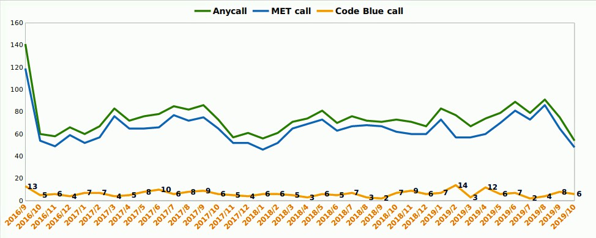

# Hospital Length of Stay (LoS) prediction @ addmision time
 
### Machine Learning project 

>> I choose to focus on a more practical statistic of healthcare, hospital length-of-stay, for my study (LOS).
The duration between admission to the hospital and discharge, measured in days, is referred to as the length of stay (LOS). 
